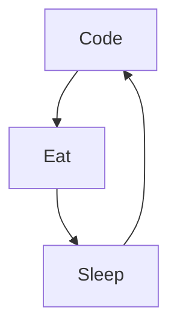

- 👋 Hi, I’m mustapha
- 👀 I’m interested in video games, cinema, pop-culture, sport ...
- 🌱 I’m currently learning Android
- 💞️ I’m looking to collaborate on project dev Android
- 📫 Who can reach me to mabdelouaha@gmail.com

----

### Languages and Tools

  
  
    
            
  
  
  
  

 

----
### Daily Routine

